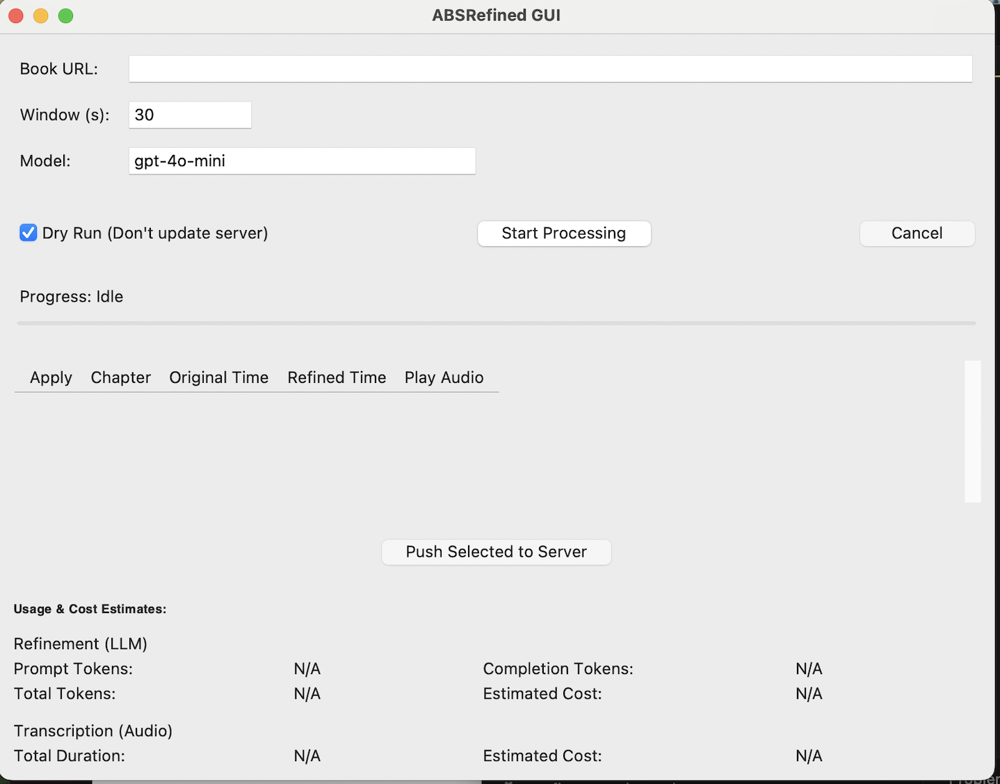

# ABSRefined: AudioBookShelf Chapter Marker Refiner

ABSRefined is a tool for improving chapter markers in audiobooks hosted on AudioBookShelf servers. It uses audio transcription and large language models to determine the precise location of chapter transitions, guided by existing chapter markers.

## Overview

Somtimes audiobook chapter markers imported from external sources, aren't precisely aligned with the actual chapter beginnings (often indicated by spoken chapter titles or distinct pauses), this tool aims to fix that. This tool was a weekend project for me to experiment with the hyped Cursor.AI development tool; because why spend 20 minutes manually fixing an edge case, when you can spend multiple weekends of your time developing a project to do it for you?

ABSRefined offers two interfaces:

1.  **Command-Line Interface (CLI):** For processing books directly from the terminal.
2.  **Graphical User Interface (GUI):** For a more interactive experience, allowing review of changes before applying them.

The core process involves:

1.  Connecting to your AudioBookShelf server.
2.  Downloading audio segments around existing chapter markers.
3.  Transcribing these segments to text using an OpenAI-compatible API.
4.  Using an LLM (via the same API) to analyze the transcription and determine the most likely precise start time of the chapter within the segment.
5.  Presenting the proposed changes (via CLI or GUI).
6.  Updating the AudioBookShelf server with the confirmed refined chapter positions.

## Installation

```bash
# 1. Clone the repository
git clone https://github.com/yourusername/absrefined.git # Replace with actual URL if different
cd absrefined

# 2. Create and activate a virtual environment (recommended)
python -m venv .venv
source .venv/bin/activate  # On Windows use: .venv\Scripts\activate

# 3. Install dependencies
# Ensure you have pip and potentially uv installed
# pip install -r requirements.txt
# Or using uv:
# uv pip install -r requirements.txt
# Install the package itself if you want to use the CLI command directly
pip install -e .

# 4. Ensure ffmpeg is installed and in your system PATH
# (Required for audio processing)
# Check installation: ffmpeg -version
# Installation methods vary by OS (e.g., brew install ffmpeg on macOS, apt install ffmpeg on Debian/Ubuntu)
```

## Configuration

ABSRefined uses a TOML configuration file (`config.toml` by default) for managing all settings.

1. Create your configuration by copying the template:

```bash
cp config.example.toml config.toml
```

2. Edit the `config.toml` file with your specific details:

```toml
[audiobookshelf]
# Your Audiobookshelf server URL
host = "https://your-abs-server.com"
# Your API key from Audiobookshelf
api_key = "your_audiobookshelf_api_key"
# Optional: Request timeout in seconds
# timeout = 30

[refiner]
# The base URL for the OpenAI-compatible API endpoint
openai_api_url = "https://api.openai.com/v1"
# Your API key for the LLM service
openai_api_key = "your_openai_api_key"
# The specific LLM model to use
model_name = "gpt-4o-mini"
# Optional: Specific model for transcription if different from default
# whisper_model_name = "whisper-1"

[processing]
# How many seconds of audio around a chapter mark to analyze
search_window_seconds = 15
# Where temporary audio files are stored
download_path = "./temp"

[logging]
# Logging level: "DEBUG", "INFO", "WARNING", "ERROR", "CRITICAL"
level = "INFO"
# Optional: Set to true to keep intermediate files for debugging
# debug_files = false
```

**Note:** Do not commit your `config.toml` file containing sensitive API keys to version control. Ensure it is listed in your `.gitignore` file.

## Usage

### Graphical User Interface (GUI)




This is the recommended way for interactive use and reviewing changes.

1.  Ensure your `config.toml` file is configured.
2.  Run the GUI script from the project root:

```bash
python gui.py
```

**GUI Features:**

*   Enter the Book URL from your Audiobookshelf instance.
*   Adjust the processing window size and LLM model if needed.
*   View processing progress.
*   Review original vs. refined timestamps for each chapter.
*   Use the ▶ button to play a short audio segment starting at the proposed timestamp (requires `simpleaudio` library: `pip install simpleaudio`).
*   Select which chapters to apply changes to using the checkboxes.
*   Push the selected changes back to the Audiobookshelf server (disable "Dry Run" first).
*   Cancel ongoing processing or server updates.

### Command-Line Interface (CLI)

Suitable for scripting or non-interactive use.

1.  Ensure your `config.toml` file is configured.
2.  Run the tool using the installed command or directly via `python -m absrefined.main`:

```bash
# Process a book using its Item ID or URL
abs-chapter-refiner "your-book-id-or-url"

# Or run as a module
python -m absrefined.main "your-book-id-or-url"

# Example: Specify a different config file
abs-chapter-refiner --config my-config.toml "your-book-id-or-url"

# Example: Dry run (show proposed changes but don't update server)
abs-chapter-refiner --dry-run "your-book-id-or-url"

# Example: Auto-confirm and update server (no prompts)
abs-chapter-refiner --yes "your-book-id-or-url"
```

**CLI Options:**

```
--- Refinement Results ---
INFO: Processed 14 chapters.

=== Chapter Comparison ===
Idx | Title                           | Original Time | Refined Time  | Diff (s) | Status
----|---------------------------------|---------------|---------------|----------|---------
1   | 1. The Greatest Story Ever Told  |  00:02:23.753 |  00:02:23.533 |   -0.220 | No Change
2   | 2. On Earth as in the Heavens    |  00:21:24.796 |  00:21:24.456 |   -0.340 | No Change
3   | 3. Let There Be Light            |  00:36:40.048 |  00:36:40.288 |   +0.240 | No Change
4   | 4. Between the Galaxies          |  00:51:15.251 |  00:51:15.751 |   +0.500 | No Change
5   | 5. Dark Matter                   |   01:06:1.552 |   01:06:1.232 |   -0.320 | No Change
6   | 6. Dark Energy                   |  01:27:22.141 |  01:27:22.281 |   +0.140 | No Change
7   | 7. The Cosmos on the Table       |  01:50:59.348 |  01:50:59.568 |   +0.220 | No Change
8   | 8. On Being Round                |  02:12:44.913 |  02:12:45.093 |   +0.180 | No Change
9   | 9. Invisible Light               |   02:28:5.352 |   02:28:5.112 |   -0.240 | No Change
10  | 10. Between the Planets          |  02:48:38.889 |  02:48:39.189 |   +0.300 | No Change
11  | 11. Exoplanet Earth              |   03:04:3.461 |   03:04:3.761 |   +0.300 | No Change
12  | 12. Reflections on the Cosmic... |  03:21:39.957 |  03:21:40.117 |   +0.160 | No Change
13  | End Credits                      |  03:39:55.484 |  03:39:55.704 |   +0.220 | No Change
INFO: 
Found 0 chapters with significant changes (>0.5s, excluding first chapter).
INFO: 
No significant chapter changes found to update on the server.
INFO: 
--- Usage & Cost Estimates ---
INFO: Refinement (LLM):
INFO:   Prompt Tokens:     17337
INFO:   Completion Tokens: 56
INFO:   Total Tokens:      17393
INFO:   Estimated Cost:    $0.0026
INFO: Transcription (Audio):
INFO:   Total Duration:    405.00s (6.75 min)
INFO:   Estimated Cost:    $0.0405
INFO: Refinement process complete.
INFO: Cleaning up temporary directory: absrefined_temp_audio
```

| Option             | Description                                              |
|--------------------|----------------------------------------------------------|
| `item_specifier`   | The Item ID or full Item URL (positional argument)       |
| `--config`         | Path to the config.toml file (default: `config.toml`)    |
| `--model`          | Override LLM model from config                           |
| `--window`         | Override search window size (seconds) from config        |
| `--download-path`  | Override temporary download path from config             |
| `--dry-run`        | Perform analysis but do not update the server            |
| `--yes`, `-y`      | Auto-confirm server updates (no prompts)                 |
| `--just-download`  | Only download the audio file and exit                    |
| `--verbose`, `-v`  | Enable INFO logging (overrides config)                   |
| `--debug`          | Enable DEBUG logging (overrides config)                  |

## How It Works (Core Logic)

1.  **Initialization**: Reads configuration from `config.toml`, command-line arguments (for CLI), or GUI inputs.
2.  **API Connection**: `AudiobookshelfClient` connects and authenticates to the server.
3.  **Refinement Process** (`ChapterRefinementTool`):
    *   Fetches original chapter data.
    *   Downloads the full audio file if needed (cached in `download_path`).
    *   For each chapter (except the first):
        *   Extracts a small audio window (`.wav` chunk) around the original marker using `ffmpeg`.
        *   Transcribes the chunk using `AudioTranscriber`.
        *   Passes the transcription and chapter context to `ChapterRefiner` (LLM call).
        *   Stores the original and potentially refined timestamps (floats).
4.  **Results Handling**:
    *   **GUI**: Populates the results table, allowing user review, playback (from chunk), selection, and final update push via `AudiobookshelfClient`.
    *   **CLI**: Compares original and refined times, displays significant changes, prompts for confirmation (if not `--dry-run`), and updates the server via `AudiobookshelfClient` if confirmed.

## Project Structure

- `gui.py`: Graphical User Interface (Tkinter).
- `absrefined/main.py`: Main entry point for the CLI.
- `absrefined/client/abs_client.py`: Client for interacting with AudioBookShelf API.
- `absrefined/transcriber/audio_transcriber.py`: Handles audio transcription.
- `absrefined/refiner/chapter_refiner.py`: Refines chapter markers using LLM.
- `absrefined/refinement_tool/chapter_refinement_tool.py`: Orchestrates the core refinement workflow (used by both GUI and CLI).
- `absrefined/utils/timestamp.py`: Utilities for timestamp handling.

## Dependencies

- `requests`: For API communication.
- `openai`: For LLM and transcription API access.
- `tomli`: (Only needed for Python < 3.11) For parsing TOML configuration files.
- `simpleaudio` (Optional, for GUI playback): For playing `.wav` audio chunks.

External Dependencies:

- `ffmpeg` and `ffprobe`: Required for audio file processing (extracting segments, getting duration). Must be installed separately and available in the system PATH.

